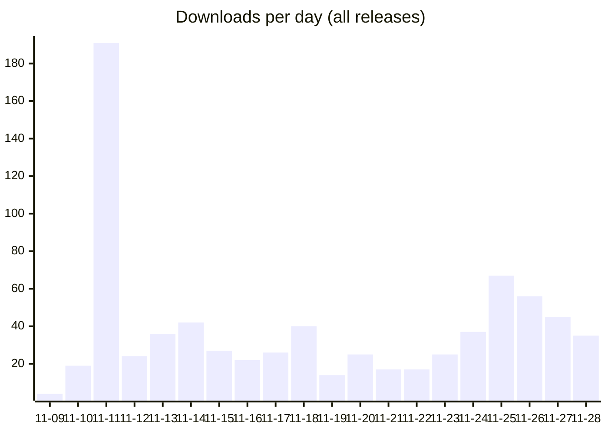
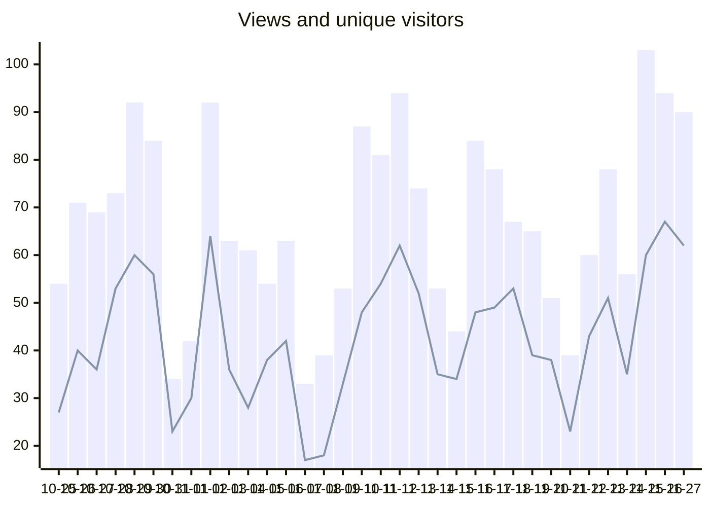

# Live-translation: statistics

Updated 2026-11-28 by the daily *Repository statistics* workflow (`.github/workflows/stats.yml` on the default branch). The figures are kept in [`data/`](data/) as CSV files, one row per day, for a spreadsheet or a dashboard.

| Downloads, versions | Downloads, all releases | Views, last 14 days |
| ---: | ---: | ---: |
| 1,408 | 1,408 | 909 |

## Downloads per version

Every file of a release counts once each time it is downloaded from GitHub. "…" means the history does not go back that far yet.

| Release | Published | Downloads | Last 7 days | Last 30 days |
| --- | --- | ---: | ---: | ---: |
| [v1.16.1](https://github.com/fmadore/Live-translation/releases/tag/v1.16.1) | 2026-11-24 | 181 | 181 | 181 |
| [v1.16.0](https://github.com/fmadore/Live-translation/releases/tag/v1.16.0) | 2026-11-23 | 37 | 37 | 37 |
| [v1.15.0](https://github.com/fmadore/Live-translation/releases/tag/v1.15.0) | 2026-11-17 | 127 | 56 | 127 |
| [v1.14.0](https://github.com/fmadore/Live-translation/releases/tag/v1.14.0) | 2026-11-13 | 109 | 1 | 109 |
| [v1.13.1](https://github.com/fmadore/Live-translation/releases/tag/v1.13.1) | 2026-11-11 | 68 | 0 | 68 |
| [v1.13.0](https://github.com/fmadore/Live-translation/releases/tag/v1.13.0) | 2026-11-10 | 18 | 1 | 18 |
| [v1.12.0](https://github.com/fmadore/Live-translation/releases/tag/v1.12.0) | 2026-10-27 | 189 | 0 | … |
| [v1.11.0](https://github.com/fmadore/Live-translation/releases/tag/v1.11.0) | 2026-10-26 | 42 | 0 | … |
| [v1.10.0](https://github.com/fmadore/Live-translation/releases/tag/v1.10.0) | 2026-10-26 | 12 | 0 | … |
| [v1.9.0](https://github.com/fmadore/Live-translation/releases/tag/v1.9.0) | 2026-10-22 | 65 | 0 | … |
| [v1.8.0](https://github.com/fmadore/Live-translation/releases/tag/v1.8.0) | 2026-10-21 | 36 | 1 | … |
| [v1.7.1](https://github.com/fmadore/Live-translation/releases/tag/v1.7.1) | 2026-10-20 | 39 | 2 | … |
| [v1.7.0](https://github.com/fmadore/Live-translation/releases/tag/v1.7.0) | 2026-10-20 | 11 | 0 | … |
| [v1.6.1](https://github.com/fmadore/Live-translation/releases/tag/v1.6.1) | 2026-10-06 | 235 | 1 | … |
| [v1.6.0](https://github.com/fmadore/Live-translation/releases/tag/v1.6.0) | 2026-10-04 | 21 | 2 | … |
| [v1.5.1](https://github.com/fmadore/Live-translation/releases/tag/v1.5.1) | 2026-09-23 | 23 | 0 | … |
| [v1.5.0](https://github.com/fmadore/Live-translation/releases/tag/v1.5.0) | 2026-09-22 | 11 | 0 | … |
| [v1.4.2](https://github.com/fmadore/Live-translation/releases/tag/v1.4.2) | 2026-09-21 | 11 | 0 | … |
| [v1.4.1](https://github.com/fmadore/Live-translation/releases/tag/v1.4.1) | 2026-09-20 | 12 | 0 | … |
| [v1.4.0](https://github.com/fmadore/Live-translation/releases/tag/v1.4.0) | 2026-09-19 | 11 | 0 | … |
| [v1.3.0](https://github.com/fmadore/Live-translation/releases/tag/v1.3.0) | 2026-09-19 | 13 | 0 | … |
| [v1.2.4](https://github.com/fmadore/Live-translation/releases/tag/v1.2.4) | 2026-09-14 | 7 | 0 | … |
| [v1.2.3](https://github.com/fmadore/Live-translation/releases/tag/v1.2.3) | 2026-09-08 | 9 | 0 | … |
| [v1.2.2](https://github.com/fmadore/Live-translation/releases/tag/v1.2.2) | 2026-09-08 | 9 | 0 | … |
| [v1.1.0](https://github.com/fmadore/Live-translation/releases/tag/v1.1.0) | 2026-08-27 | 13 | 0 | … |
| [v1.0.5](https://github.com/fmadore/Live-translation/releases/tag/v1.0.5) | 2026-08-26 | 6 | 0 | … |
| [v1.0.0](https://github.com/fmadore/Live-translation/releases/tag/v1.0.0) | 2026-08-21 | 9 | 0 | … |
| [v0.6.0](https://github.com/fmadore/Live-translation/releases/tag/v0.6.0) | 2026-08-20 | 3 | 0 | … |
| [v0.5.3](https://github.com/fmadore/Live-translation/releases/tag/v0.5.3) | 2026-08-12 | 9 | 0 | … |
| [v0.5.2](https://github.com/fmadore/Live-translation/releases/tag/v0.5.2) | 2026-08-12 | 7 | 0 | … |
| [v0.5.1](https://github.com/fmadore/Live-translation/releases/tag/v0.5.1) | 2026-08-07 | 7 | 0 | … |
| [v0.5.0](https://github.com/fmadore/Live-translation/releases/tag/v0.5.0) | 2026-08-07 | 7 | 0 | … |
| [v0.4.0](https://github.com/fmadore/Live-translation/releases/tag/v0.4.0) | 2026-08-01 | 7 | 0 | … |
| [v0.3.0](https://github.com/fmadore/Live-translation/releases/tag/v0.3.0) | 2026-07-28 | 6 | 0 | … |
| [v0.2.3](https://github.com/fmadore/Live-translation/releases/tag/v0.2.3) | 2026-06-30 | 8 | 0 | … |
| [v0.2.2](https://github.com/fmadore/Live-translation/releases/tag/v0.2.2) | 2026-06-30 | 10 | 0 | … |
| [v0.2.1](https://github.com/fmadore/Live-translation/releases/tag/v0.2.1) | 2026-06-30 | 7 | 0 | … |
| [v0.2.0](https://github.com/fmadore/Live-translation/releases/tag/v0.2.0) | 2026-06-29 | 7 | 0 | … |
| [v0.1.1](https://github.com/fmadore/Live-translation/releases/tag/v0.1.1) | 2026-06-18 | 6 | 0 | … |
| [v0.1.0](https://github.com/fmadore/Live-translation/releases/tag/v0.1.0) | 2026-06-17 | 0 | 0 | … |

## Downloads per day, last 60 days

```mermaid
xychart-beta
    title "Downloads per day (all releases)"
    x-axis ["11-09", "11-10", "11-11", "11-12", "11-13", "11-14", "11-15", "11-16", "11-17", "11-18", "11-19", "11-20", "11-21", "11-22", "11-23", "11-24", "11-25", "11-26", "11-27", "11-28"]
    bar [4, 19, 191, 24, 36, 42, 27, 22, 26, 40, 14, 25, 17, 17, 25, 37, 67, 56, 45, 35]
```

## Files of v1.16.1

| File | Downloads |
| --- | ---: |
| Live.Translation_1.16.1_x64-setup.exe | 69 |
| Live.Translation_1.16.1.msixbundle | 60 |
| Live.Translation_1.16.1_aarch64.dmg | 22 |
| Live.Translation_1.16.1_x64_en-US.msi | 12 |
| Live.Translation_1.16.1_arm64.msix | 9 |
| Live.Translation_1.16.1_x64.msix | 9 |

## Visits to the repository, last 60 days

Bars are views, the line unique visitors (GitHub's daily figures, UTC; today is still counting).

```mermaid
xychart-beta
    title "Views and unique visitors"
    x-axis ["10-25", "10-26", "10-27", "10-28", "10-29", "10-30", "10-31", "11-01", "11-02", "11-03", "11-04", "11-05", "11-06", "11-07", "11-08", "11-09", "11-10", "11-11", "11-12", "11-13", "11-14", "11-15", "11-16", "11-17", "11-18", "11-19", "11-20", "11-21", "11-22", "11-23", "11-24", "11-25", "11-26", "11-27"]
    bar [54, 71, 69, 73, 92, 84, 34, 42, 92, 63, 61, 54, 63, 33, 39, 53, 87, 81, 94, 74, 53, 44, 84, 78, 67, 65, 51, 39, 60, 78, 56, 103, 94, 90]
    line [27, 40, 36, 53, 60, 56, 23, 30, 64, 36, 28, 38, 42, 17, 18, 33, 48, 54, 62, 52, 35, 34, 48, 49, 53, 39, 38, 23, 43, 51, 35, 60, 67, 62]
```
